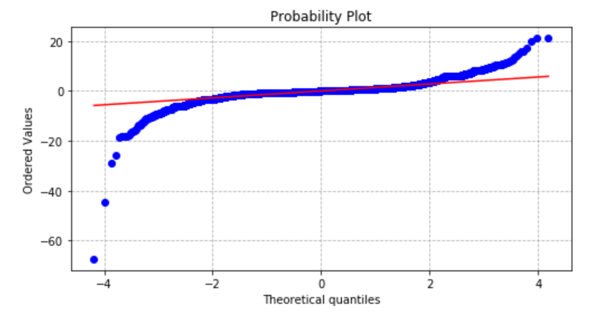
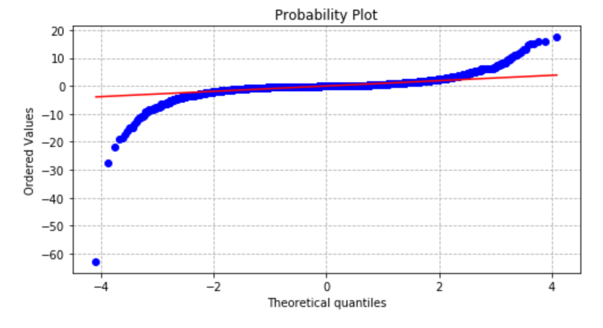

# DS_Mod_2_Project
Predicting Tips for NYC yellow cab rides using data provided by the Taxi & Limousine Commission as well as weather data pulled from the Dark Sky API.

## Methodology ##
* Pulled October 2018 data from Dark Sky API and NYC TLC Trip Record Data
* Dependent variable: tip amounts (in USD)
* Indepdent variables tested: trip distance, fare amount, toll amount, trip time, temperature, inclimate weather, passenger count, rate code (i.e. standard fare or trip from airport), payment, day of week, time of day, neighborhoods and boroughs.

## Challenges ##
* Large data set: almost 9 million records with an initial sample of 250,000 later reduced to 50,000
  * Caused certain algorithms to take a long time to run
* Tips were not normally distributed
 
* Many tip amounts just zero as seen above
* Most engineered features and all inserted variables did not correlate
 
* Transformations of data did nothing to improve models

## Correlation Heat Map ##
 
* Light green means little to no correlation (approaching 0)
* Dark green, white and red means at least some correlation

 ## Final Models ##
| Model 1 | Model 2 |
| -------- | -------- |
| | |
| | |
* Chose two to account for zero tip valuesL one with them included and one without
* Despite all variables tested, the only ones that could help build the model were fare amount, toll amount, trip type (rate code) and payment type
 * All coefficients were positive with both models starting below zero, one significantly more than the other
 * Rate Code 4, which are trips from Nassau and Westchester, had the most positive effect on tips for both models, while Rate Code 3, trips from Newark, had the lowest
 * In Model 1 Payment Type 1, credit card, had a much higher effect than 2 which was cash. This is explained by all of the zero values and was the driver for why these variables were included in the first place.
* Naturally, the model assuming at least some tip performed much better

## Analyzing Performance ##
| Model 1 QQ Plot  | Model 2 QQ Plot|
| -------- | -------- |
| | |
| Average Error: $0.83 | Average Error: $0.41 |
* Both models do a decent job of predicting values that fall within the middle quantitles, but tail off on both ends.
