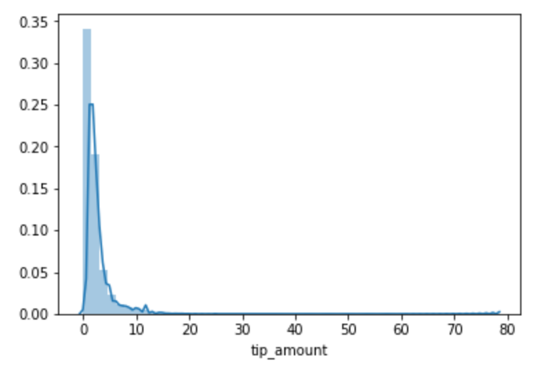
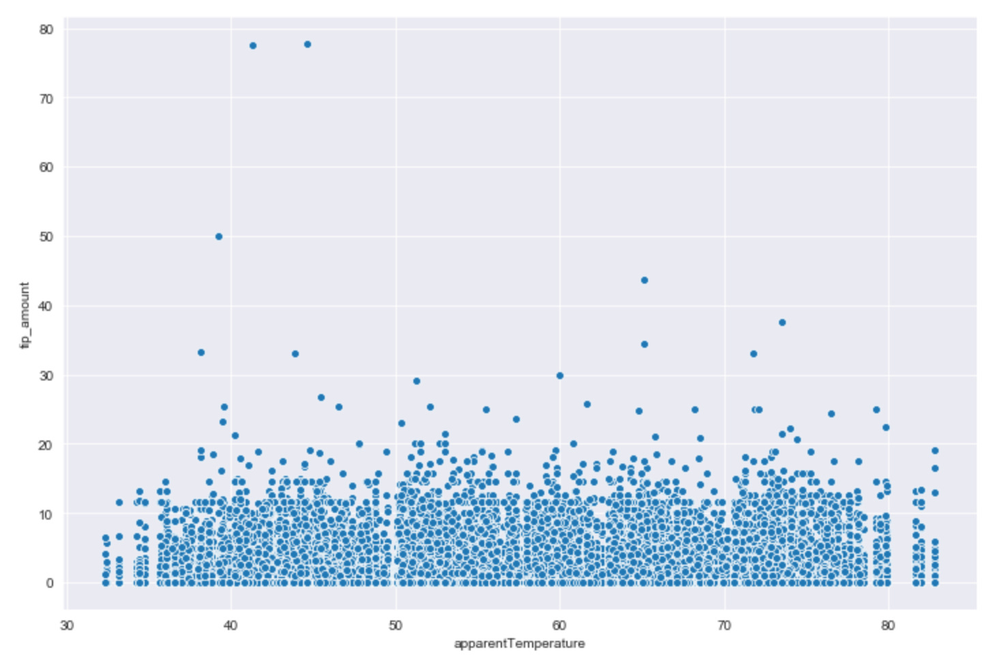
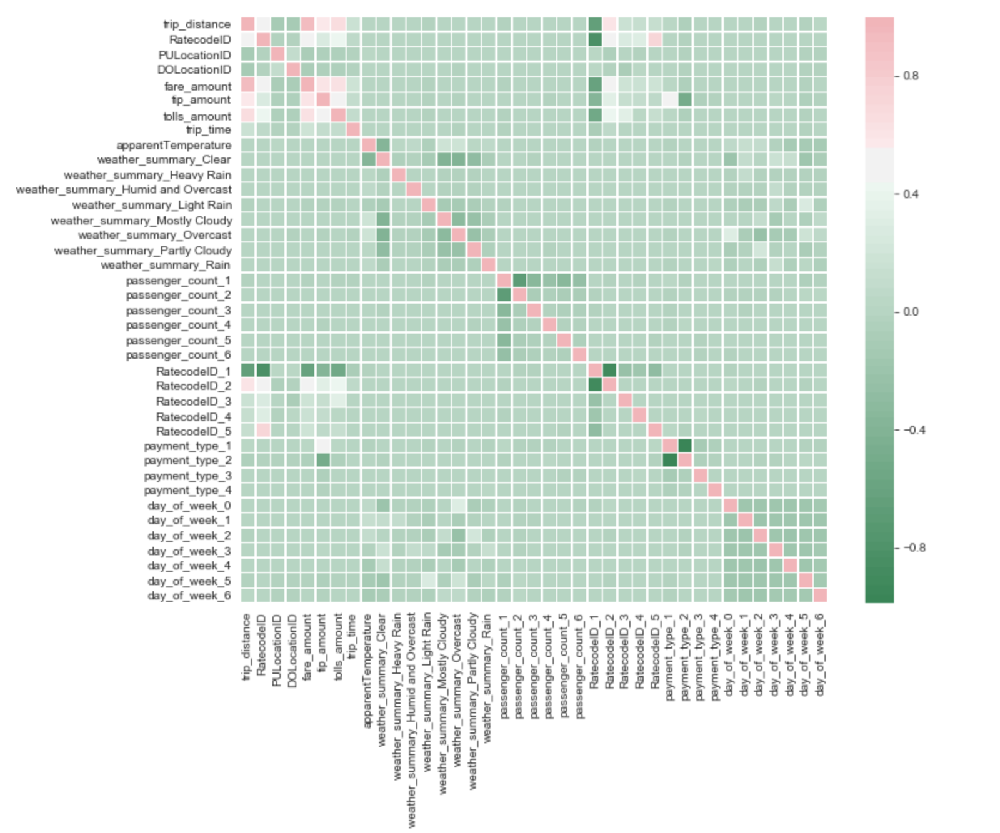
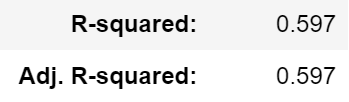
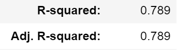
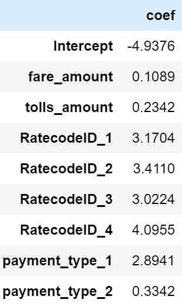
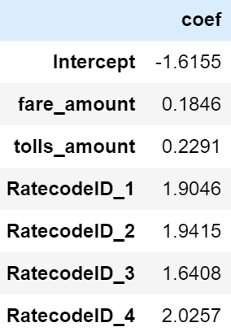

# DS_Mod_2_Project
Predicting Tips for NYC yellow cab rides using data provided by the Taxi & Limousine Commission as well as weather data pulled from the Dark Sky API.

## Methodology ##
* Pulled October 2018 data from Dark Sky API and NYC TLC Trip Record Data
* Dependent variable: tip amounts (in USD)
* Indepdent variables tested: trip distance, fare amount, toll amount, trip time, temperature, inclimate weather, passenger count, rate code (i.e. standard fare or trip from airport), payment, day of week, time of day, neighborhoods and boroughs.

## Challenges ##
* Large data set: almost 9 million records with an initial sample of 250,000 later reduced to 50,000
  * Caused certain algorithms to take a long time to run
* Tips were not normally distributed
 
* Many tip amounts just zero as seen above
* Most engineered features and all inserted variables did not correlate
 
* Transformations of data did nothing to improve models

## Correlation Heat Map ##
 
* Light green means little to no correlation (approaching 0)
* Dark green, white and red means at least some correlation

 ## Final Models##
| Model 1  |Model 2 |
| ------------- | ------------- |
 | 
 | 
